# TODO

* /sys/module/libata/parameters/ignore_hpa auf 0 setzen
* HPA/DCO sichern (beachte Leitfaden S. 58)
* in unpartitionierten Bereichen könnten sich Daten verstecken (S. 63)
* nicht dem Dateisystemtyp in der Partitionstabelle trauen (S. 62)
* Working copy anlegen: `dd if=image.dd of=wc.dd status=progress`
* Am Ende der Arbeit nochmal eine Prüfsumme anlegen
* Bei unvermeidbaren Schreibzugriffen schrittweise Prüfsummen für lückenlose Beweisführung anlegen (Chain of custody)

wiederholende Null-Bytes unterdrücken
xxd -a 

4 Partitionstabelleeinträge des MBR auslesen
`dd if=mbr.dd bs=1 skip=$((0x1be)) count=$((4*16)) | xxd`
* Das Typ Byte im Partitionstabelleneintrag ist kein ausreichender Indikator für ein Dateisystem. Besser ist fsstat,
dort tragen wesentlich mehr ... zur .. bei

Partition
- zu Beginn gibt die Paritionstabelle nur die vermeintlichen Dateisysteme an (muss verifiziert werden, dass Angaben konsistent sind, siehe Programm fsstat in Besprechung Übung 2)
- sollten mit dd zur weiteren Untersuchung einzeln extrahiert werden

Partition in Datei schreiben
```bash
$ dd if=/dev/sdb1 of=partition1.dd
```

# Dateisystem
- Unterscheidung zwischen (nicht-) essentiallen Daten
- ungenutzte Volume Slack Sektoren bei der Analyse nicht vergessen

- Informationen im Bootsektor sind als vertrauenswürdig einzustufen, da sonst das Dateisystem korrumpiert sein würde (1. Vorlesung vom PW Folie 19)
- mit sigfind kann den Beginn der MFTs von NTFS Dateisystemstrukturen finden

# Arbeitskopie
- beim Anlegen der Arbeitskopie die richtigen Fachbegriffe verwenden (S. 54f, "bitgenau" etc.)
- Anlegen einer Arbeitskopie S. 55

Arbeitskopie anlegen
```bash
$ dd if=image-fat.dd of=wc.dd bs=4096
```

Liste mit Hashwerten mehrerer Dateien anlegen und vergleichen
```bash
$ sha256sum *.dd > hashlist
$ sha256sum -c hashlist
partition1.dd: OK
partition2.dd: OK
```

# Partitionsschema: DOS

## Bootsektor / Partitionstabelleneintrag

Datenstruktur des MBR  


Datenstruktur eines Partitionstabelleneintrag des MBR. Jeder Eintrag ist 16 Byte groß.


Partitionen auflisten
```bash
$ fdisk -l image.dd
# oder
$ mmls image.dd
```

MBR auslesen
```bash
$ dd if=image-usb-stick.dd of=mbr.dd bs=512 count=1 status=none
```

Windows-Signatur auslesen
```bash
$ dd if=mbr.dd bs=1 skip=440 count=4 status=none | xxd -g1
```

Ersten Partitionstabelleneintrag des MBR auslesen
```bash
$ dd if=mbr.dd bs=512 count=1 status=none | dd bs=1 skip=446 count=16 status=none | xxd
00000000: 0000 0200 ee2a a00a 0100 0000 ffff 7f00  .....*..........
# 2. bis 4. Eintrag auslesen
# dd if=image-usb-stick.dd bs=1 count=16 skip=462 status=none
# dd if=image-usb-stick.dd bs=1 count=16 skip=478 status=none
# dd if=image-usb-stick.dd bs=1 count=16 skip=494 status=none
```

Alle 4 Partitionstabelleneinträge ausgeben
```bash
$ dd if=mbr.dd bs=1 skip=$((0x1be)) count=$((4*16)) status=none
```

Partitionsschema eines Abbildes auflisten
```bash
$ mmls image_ws.dd
[REMOVED]
      Slot      Start        End          Length       Description
000:  Meta      0000000000   0000000000   0000000001   Primary Table (#0)
001:  -------   0000000000   0000002047   0000002048   Unallocated
002:  000:000   0000002048   0000309247   0000307200   DOS FAT16 (0x06)
[REMOVED]
```

Partition extrahieren
```bash
$ dd if=image_ws.dd of=partition1.dd skip=2048 count=307200
```

```bash
$ mmcat image_ws.dd 2 > partition1.dd
```

# Partitionsschema: GPT

Vorteile im Vergleich zu DOS:
* 64- statt 32-Bit Adressierung
* erlaubt Verwaltung von 128 Partitionen (DOS: 4 Primärpartitionen)
* CRC-32 Prüfsumme bietet besseren Schutz vor Manipulation als lediglich `55aa` Signatur
* Backup GPT-Partitionstabelle am Ende der Partition

Partitionen auflisten
```bash
$ gdisk -l gptimage.dd
```

Übersicht einer GPT partitionierten Festplatte. Im letzten Sektor liegt das Backup des Bootsektors. Davor das Backup der Partitionstabelle.  


Integrität des GPT-Partitionsschema validieren und korrigieren
```bash
$ gdisk gptimage.backup.dd
[REMOVED]
Caution! After loading partitions, the CRC doesn't check out!
Warning! Main partition table CRC mismatch! Loaded backup partition table
instead of main partition table!
[REMOVED]
Main partition table: ERROR
[REMOVED]
Partition table scan:
  MBR: protective
  BSD: not present
  APM: not present
  GPT: damaged
```

## Protective MBR

An LBA 0 steht der geschützte MBR. Dieser enthält genau eine Partition, welche den gesamten Datenträger umfasst. Er gewährleistet Rückwärtskompatibiltät und verhindert, dass nicht-GPT Systeme den Datenträger als leer einstufen.

```bash
$ mmls -t dos gptimage.dd
      Slot      Start        End          Length       Description
000:  Meta      0000000000   0000000000   0000000001   Primary Table (#0)
001:  -------   0000000000   0000000000   0000000001   Unallocated
002:  000:000   0000000001   0008388607   0008388607   GPT Safety Partition (0xee)
```

## (Backup-)Bootsektor

Steht immer an LBA 1.


Das Backup des Bootsektors ist *nicht* bitgenau zum originalen Bootsektor. Es unterscheidet sich in den Verweisen auf die aktuelle/weitere Partitionstabelle (Offset 24 bzw. 32). Somit sind auch die Prüfsummen unterschiedlich (Offset 16).


Beide Bootsektoren finden
```bash
$ sigfind -b 512 4546 gptimage.dd
Block size: 512  Offset: 0  Signature: 4546
# regulärer Bootsektor
Block: 1 (-)
# Backup Bootsektor
Block: 8388607 (+8388606)
```

## (Backup-)Partitionstabelle

Die Partitionstabelle ist nicht Teil des Bootsektors. Sie liegt separat und umfasst bis zu 128 Einträge.  
Ihr LBA steht im Bootsektor an Offset 72-79.  
Ein Backup davon liegt im Backup-Bereich des GPT Datenträgers.

Position der Backup-Partitionstabelle berechnen
```bash
$ mmls gptimage.dd
[REMOVED]
007:  -------   0008388000   0008388607   0000000608   Unallocated
# Anzahl und Größe der Partitionstabelleneinträge aus Bootsektor auslesen; hier: 128 * 128
```

Rechenbeispiel
```
- Letzer Sektor der Partition - Größe der Partitionstabelle in Sektoren
8388607 Sektoren - (128 Einträge * 128 Byte pro Eintrag) / 512 Byte pro Sektor
8388607 Sektoren - 32 Sektoren = 8388575 LBA
```

Alternativ die GUID des ersten Partitionstabelleneintrag als Signatur verwenden
```bash
$ sigfind -b 512 a4bb94de gptimage.dd
Block size: 512  Offset: 0  Signature: A4BB94DE
Block: 2 (-)
Block: 8388575 (+8388573)
```

Bei einem korrupten Schema lässt sich die Backup-Partitionstabelle auch mit `gdisk` wiederherstellen.

## Partitionstabelleneintrag

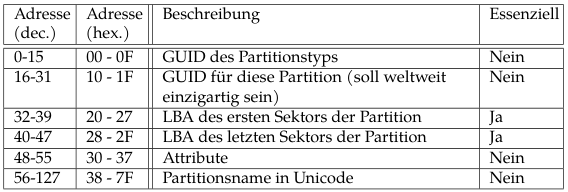

Zweiten Partitionstabelleneintrag aus Abbild auslesen bzw. 
```bash
$ dd if=gptimage.dd skip=2 count=1 status=none | dd of=entry2_2.dd bs=128 skip=1 count=1
```

... direkt Partitionstabelle auslesen
```bash
$ dd if=gpt-partition-table.dd of=entry2_1.dd bs=128 skip=1 count=1
```

# FAT12/16/32

## Bootsektor


Clustergröße in Bytes anhand Bootsektor ermitteln
```
= Clustergröße in Sektoren @ (13) * Sektorgröße in Bytes @ (11-12) 
```

Größe des reservierten Datenbereiches in Bytes
```
= Größe reservierter Datenbereich in Sektoren @ (14-15) * Sektorgröße in Bytes @ (11-12) 
```

Größe des Wurzelverzeichnisses in Bytes
```
- Eintrag im Wurzelverzeichnis immer: 32 Bytes
- = Anzahl Einträge @ (17-18) * 32 Bytes
```

### Zusätzliche Bootsektorinformationen für FAT32


### Korrupten FAT32 Bootsektor wiederherstellen

In FAT32 existiert für gewöhnlich ein Backup des Bootsektors an LBA 6.
```bash
# Prüfen, ob Backup Bootsektor an Sektor 6 existiert
$ fsstat -o 6 wc.dd 

# Wiederherstellen
$ dd if=wc.dd of=bootsector.backup.dd skip=6 count=1
$ dd if=bootsector.backup.dd of=wc.fixed.dd conv=notrunc
```

- Was bedeutet 12/16/32?
  - Größe des Cluster-Pointers in der FAT
- Wo beginnt der FAT Bereich bzw. Datenbereich?
  - Muss im Bootsektor nachgeschlagen werden
- Wo steht das Wurzelverzeichnis?
  - FAT12/16: Immer am Anfang des Datenbereichs
  - FAT32: Kann beliebig im Datenbereich liegen
- Wo beginnen die Clusteradressen?
  - werden erst im Datenbereich verwendet
  - FAT12/16: Erst NACH dem Wurzelberzeichnis
  - FAT32: Bereits mit Beginn des Wurzelverzeichnisses
- Wo liegen Clusteradresse 0 und 1?
  - Gibt es nicht. 0 = nicht allozierte Cluster, 1 = keine nachvollziehbare Begründung
  - kleinste gültige Clusteradresse 2
- Welche 3 Bereiche existieren?
  - Reservierter (Bootsektor),
  - FAT Bereich (Primary FAT, Backup FAT, sind 2 identische File Allocation Tables)
  - Datenbereich (Verzeichnisse und Dateien)


- DS = Dateisystem-Slack, Sektoren, übrige Sektoren, die nicht mehr in einen Cluster (z.B. bestehend aus 8 Sektoren) zusammenfassen lassen
- Slack = wenn eine Datenstruktur nicht den gesamten Datenbereich ausnutzt, bleiben ungenutzte Sektoren übrig

## Dateisystemlayout

Die Position des Wurzelverzeichnisses ist in FAT12/16 am Anfang des Datenbereichs fixiert. In FAT32 ist sie variabel.  
In FAT32 existiert ein Backup Bootsektor im reservierten Datenbereich.  
In FAT12/16 beginnen Clusteradressen am Ende des Wurzelverzeichnisses. In FAT32 mit Beginn des Datenbereiches.  


Maximal adressierbare Anzahl Cluster im Dateisystem
```
- 2^(Bitlänge FAT-Eintrag)
- z.B. FAT16: 2^16 = 65536 Cluster
```

Dateisystem-Slack (DS) berechnen
```
# Sector Size: 512
# Cluster Size: 4096
# Non-clustered: 983038 - 983039
# FAT 0: 32 - 990
- Anzahl übrige Sektoren = Größe des Dateisystems in Sektoren - Reservierter Bereich - (2 * Größe FAT) mod (Sektoren pro Cluster)
                         = 983040 - 32 - 2 * 959 mod 8 = 2
- Startsektor DS = Größe des Dateisystems in Sektoren - Anzahl übrige Sektoren = 983038
```

## File Allocation Table (FAT)

FAT Bereich wird *nicht* über Cluster adressiert.  
Größe einer FAT = Größe pro Eintrag * Anzahl Einträge.  
Startet direkt hinter reserviertem Bereich.

FAT0 aus Abbild extrahieren
```bash
# FAT 0: 8 - 155
# +1 damit letzter Eintrag noch dabei ist
$ dd if=partition1.dd of=fat0.dd bs=512 skip=8 count=$((155+1-8))
```

```bash
$ blkcat partition1.dd 8 155 > fat0.dd
```

FAT0 mithilfe von virtueller Metadatenadresse auslesen
```bash
$ fls -r partition1.dd
# $MBR != MBR, sondern = Bootsektor
v/v 4784131:    $MBR
v/v 4784132:    $FAT1
v/v 4784133:    $FAT2

$ icat fat32_partition.dd 4784132 | xxd -c 4
00000000: f8ff ff0f  ....
00000004: ffff ffff  ....
00000008: ffff ff0f  ....
[REMOVED]
```

### Cluser Chain

Verzeichniseintrag enthält Clusteradresse des Startclusters. Ein Eintrag verweist auf Nachfolgecluster oder End-Of-File.  
Cluster-Chain für file.txt ist `30-31-34`:


Noch allozierte Cluster-Chains einer Partition auflisten
```bash
$ fsstat partition2.dd
[REMOVED]
FAT CONTENTS (in sectors)
--------------------------------------------
336-815 (480) -> EOF
816-22927 (22112) -> EOF
[REMOVED]
```

Belegte Sektoren pro Cluster-Chain berechnen
```
Anzahl Sektoren pro Cluster * Anzahl Elemente der Cluster-Chain
```

Allokationsstatus und Cluster zu einem Sektor ausgeben
```bash
$ blkstat wc.dd 10958
Sector: 10958
Allocated
Cluster: 1128
```

### FAT-Eintrag

Gibt Belegstatus des zugehörigen Clusters n an
* Wert 0: Cluster ist nicht-alloziert
* Wert != 0: alloziert, Zeiger auf folgenden Cluster oder EOF-Label

Länge eines Cluster-Zeigers (12/16/32 Bit) wird durch die FAT-Variante bestimmt.  
Nummerierung der FAT-Einträge beginnt bei 0, aber nur die Einträge n >= 2 referenzieren Cluster. 0 und 1 sind irrelevant.  

Bedeutung der FAT-Zeigerwerte  


Einträge der FAT0 eines FAT32 Dateisystems mit korrekten Indizes ausgeben
```bash
$ xxd -c4 fat0.dd | nl -v0
# FAT-Zeiger 0: existiert nicht
0  00000000: f8ff ff0f  ....
# FAT-Zeiger 1: existiert nicht
1  00000004: ffff ffff  ....
# FAT-Zeiger 2: 0x0fffffff = EOF-Label
# Der Datei, die auf Startclusteradresse 2 verweist, ist genau 1 Cluster zugewiesen
# Würde es einen Cluster davor geben, müsste es einen Cluster geben, der auf 2 verweist
2  00000008: ffff ff0f  ....
3  0000000c: ffff ff0f  ....
4  00000010: ffff ff0f  ....
# FAT-Zeiger 5 (0x06): verweist auf Cluster 6
5  00000014: 0600 0000  ....
# FAT-Zeiger 6 (0x07): verweist auf Cluster 7
# Cluster-Chain: 5-6-7-8...
6  00000018: 0700 0000  ....
7  0000001c: 0800 0000  ....
8  00000020: 0900 0000  ....
[REMOVED]
```

Indizierung in FAT32: Relatives Offset des n-ten Eintrag in der FAT
```
relatives Offset = n * 4 Byte pro Eintrag
```

### FAT-Einträge zu Datei finden

Wurzelverzeichnis des Verzeichnisses ausgeben, indem sich die Datei (Metadatenadressen `70`) befindet
```bash
$ fls -r partition1.dd
d/d 3:  $RECYCLE.BIN
+ r/r 69:       desktop.ini
+ r/r 70:       $I6CKD6D.jpg
```

Startcluster Adresse @ Offset 26-27 (und ggfl. 20-21) auslesen. Hier: `0x030a` (778)
```bash
$ icat partition1.dd 3 | xxd -c32
[REMOVED]
00000060: 2449 3643 4b44 3644 4a50 4720 109b 027a 7148 7148 0000 037a 7148 0a03 2002 0000  $I6CKD6DJPG ...zqHqH...zqH.. ...
[REMOVED]
```

FAT-Eintrag 3 in FAT0 ausgeben und länge der Cluster-Chain ablesen oder berechnen
```bash
# FAT-Eintrag 778
# 1 Cluster (hier: 4 Sektoren), dann EOF-Label.
$ xxd -c4 fat0.dd | nl -v0
777  00000c24: 0000 0000  ....
778  00000c28: ffff ff0f  ....
779  00000c2c: 0000 0000  ....
```

Überprufen anhand der Metadaten. 1 Cluster alloziert. Davon sind 2 Sektoren belegt.
```bash
$ istat partition1.dd 70
[REMOVED]
Sectors:
11296 11297 0 0
```

### Umrechnung: Cluster zu Sektor / Sektor zu Cluster

Erste Clusteradresse einer Datei bestimmen. Hierzu den LBA des ersten Sektors den `istat` liefert in eine Clusteradresse umrechnen
```bash
# Beispiel: erster Sektor der Datei 8204
# Clusteradresse 2 beginnt mit Datenbereich an 8192
# Clustergröße: 2048, Sektorgröße 512
- Clusteradresse = (LBA erster Sektor - Sektor der 2. Clusteradresse) / (Größe Cluster in Sektoren / Sektorgröße) + 2
- (8204 - 8192) / (2048 / 512) + 2 = 5
- Sektor: 8204 in Cluster: 5
```

Sektoren eines Clusters berechnen
```
Start-Sektoradresse des Clusters k = (gegebener Cluster k - 2) * Sektoren pro Cluster + Sektoradresse von Cluster 2
Ende-Sektoradresse = Start-Sektoradresse des Clusters k + Anzahl Sektoren pro Cluster - 1
```

## Wurzelverzeichnis (Root Directory)

Liste mit (Basis-)Verzeichniseinträgen (je 32 Byte).
Speichert neben Dateinamen, auch Metadaten, wie Adresse des 1. Clusters des Dateiinhalts, MAC-Zeitstempel, Dateigröße.  
In FAT12/16 an fixer Stelle und fester Größe. In FAT32 im Clusterbereich und variable Größe.


Mögliche Attribute eines Verzeichniseintrags


Vollständiges Wurzelverzeichnisses auslesen mit korrekter Metadatenadresse auslesen
```bash
# fsstat: *** Root Directory: 8192 - 8195
$ dd if=partition1.dd skip=8192 count=$((8195+1-8192)) | xxd -c32 | nl -v3 | less
3  00000000: 2452 4543 5943 4c45 4249 4e16 0047 5b55 6a48 6a48 0000 5c55 6a48 0300 0000 0000  $RECYCLEBIN..G[UjHjH..\UjH......
4  00000020: e537 0063 0035 0065 0030 000f 6631 6400 3600 6600 6500 3800 0000 0000 ffff ffff  .7.c.5.e.0..f1d.6.f.e.8.........
5  00000040: e52d 0034 0032 0038 0030 000f 6c31 2d00 6200 3700 3100 3500 2d00 0000 3100 3800  .-.4.2.8.0..l1-.b.7.1.5.-...1.8.
6  00000060: e535 0031 0065 0039 0039 000f 6131 3700 3000 3300 2d00 6600 6400 0000 6600 6400  .5.1.e.9.9..a17.0.3.-.f.d...f.d.
7  00000080: e531 4539 3937 7e31 2020 2010 67bf bd7a 6a48 6a48 0000 c07a 6a48 0500 0008 0000  .1E997~1   .g..zjHjH...zjH......
[REMOVED]
```

Verzeichniseintrag mit Metadatenadresse 28 auslesen.
```bash
# -3, denn der erste Basisverzeichniseintrag $RECYCLE.BIN beginnt bei Metadatenadresse 3
$ icat fat32_partition.dd 2 | dd bs=32 skip=$((28-3)) count=1 status=none | xxd
00000000: 4c41 4745 4245 7e31 5044 4620 0074 8d79  LAGEBE~1PDF .t.y
00000010: 6f48 6f48 0000 9179 6f48 0500 b050 1600  oHoH...yoH...P..
```

Metadatenadresse zu Wurzelverzeichnis-Offset berechnen
```bash
# Eintrag
000003a0: e545 5448 414d 7e31 4a50 4720 00a1 fc79 7148 7148 0000 f36a 6a48 d802 049b 0000  .ETHAM~1JPG ...yqHqH...jjH......

> Offset 0x3e0 / 32 Byte pro Eintag + 1 # weil 0 basiert
Metadatenadresse: 32
```

### Long File Name

Verzeichniseintrag für Long File Name


Für Dateinamen mit mehr als 11 Zeichen wird ein Long File Name (LFN) angelegt.  
Die Zeichen in langen Dateinamen werden als 2 Byte UTF-16 gespeichert.  
Der letzte Sequenznummer wird mit der Konstante `0x40` exlusiv-ODER verknüpft.  
Für den Basiseintrag wird aus Kompatibilitätsgründen einen 8.3 langer Dateiname aus dem Long File Name generiert.

```bash
# Verzeichniseintrag: n-2 speichert die nächsten 13 Zeichen
# Letzte Sequenznummer: 0x42 ^ 0x40 = 0x2
26  000002e0: 42 31 00 35 00 2e 00 70 00 64 00 0f 00 fa 66 00 00 00 ff ff ff ff ff ff ff ff 00 00 ff ff ff ff  B1.5...p.d....f.................
# Verzeichniseintrag: n-1 speichert die ersten 13 Zeichen
# Beginnt mit Sequenznummber 01 (Offset 0x300)
27  00000300: 01 66 6c 61 67 7b 53 65 00 62 00 0f 00 fa 65 00 72 00 69 00 63 00 68 00 74 00 00 00 32 00 30 00  .flag{Se.b....e.r.i.c.h.t...2.0.
# Basiseintrag: n
28  00000320: 4c 41 47 45 42 45 7e 31 50 44 46 20 00 74 8d 79 6f 48 6f 48 00 00 91 79 6f 48 05 00 b0 50 16 00  LAGEBE~1PDF .t.yoHoH...yoH...P..
```


### (Gelöschte) Datei wiederherstellen

Datei in FAT-Dateisystem löschen.  
Das erste Byte im Verzeichniseintrag wird auf `5e` gesetzt.  
Die zugehörigen Cluser in der FAT werden auf `0` gesetzt.  
Der Verzeichniseintrag im Wurzelverzeichnis bleibt erhalten.


Dateien lassen sich anhand ihrer Metadatenadresse wiederherstellen.  
Dateien liegen innerhalb des Datenbereichs in Clustern. Ein Cluster umfasst mehrere Sektoren.  
Dateien können fragmentiertet auf verschiedene Clustern verteilt sein.

Nicht-fragmentierte, gelöschte Dateien wiederherstellen
```bash
$ $ istat partition1.dd 32
Directory Entry: 32
[REMOVED]
Sectors:
11096 11097 11098 11099 11100 11101 11102 11103
11104 11105 11106 11107 11108 11109 11110 11111
[REMOVED]
```
```bash
$ icat partition1.dd 32 > recovered.jpg
```

Alle gelöschten Dateien wiederherstellen
```bash
$ mkdir recovered_files
$ tsk_recover wc.dd recovered_files
```

Der *RAM-Slack* ist der nicht belegte Bereich des letzten benutzten Sektors für den Dateiinhalt.  
Der *Drive-Slack* beschreibt die vollständig unbenutzten Sektoren eines Clusters.
Der *File-Slack* ist die Summe aus RAM-Slack + Drive-Slack.  


Datei mit File-Slack wiederherstellen
```bash
$ icat -s partition1.dd 28 > lagebericht.slack.pdf
```

Alle gelöschten Dateien rekursiv anzeigen
```bash
$ fls -r -d wc.dd
r/r * 195976:   data/crystal.jpg
r/r * 10:       darkly.jpg
d/d * 26:       find_me
r/r * 304646:   find_me/secret
```

## Zeitstempel

Die Zeitstempel lassen sich aus den Verzeichnisseinträgen der FAT auslesen.  
Unterschiedliche Zeitstempel haben unterschiedliche Genauigkeiten.
* Erzeugungszeitpunkt auf 10 ms genau
* letzter schreibender Zugriff auf 2 Sekunden genau
* letzter lesender Zugriff auf den Tag genau

### Datum

Datum hat Format TT.MM.JJJJ und ist 16-Bit Wert.  
Auf das Jahr muss 1980 addiert werden.
> Jahr (7 bit)  | Monat: (4 bit)  | Tag: (5 bit)
```python
# Example: 0x3281 (01.04.2005)
> format(0x3281, 'b')     # or
> "{0:b}".format(0x3281)  # hex to binary
'11001010000001'

# Jahr (7 bit)  | Monat: (4 bit)  | Tag: (5 bit)
# 0011001       | 0100            | 00001
> int('0011001', 2)       # binary to hex
```

### Uhrzeit

Zeitstempel: HH:MM:SS.MSE setzt sich aus HH:MM:SS (16-Bit) und MSE (8-Bit) zusammen.  
```
Hexdump: A0F653
                      Millisekunden 8-Bit | Uhrzeit HH:MM:SS 16-Bit
big endian:           A0                  | F653
little endian:        0xA0                | 0x53F6
```

HH:MM:SS berechnen
```python
# Stunden (5 bit) | Minuten: (6 bit)  | Sekunden: (5 bit) * 2
# 01010           | 011111            | 10110
# 10              | 31                | 22 * 2 = 44
```

MSE berechnen
```python
# Sekunden = Hexwert Millisekunden * 10ms / 1000
> 0xa0 * 10 / 1000
1.6
# 10:31:44 + 1.6 = 10:31:45.600
```

Keine hinreichende, aber notwendige Bedingung für FAT32 Dateisystem (2. Vorlesung PW Folie 19)
- Belastbare Argumente, wenn charakteritische Merkmale eine Plausibilitätsprüfung bestehen
- fsstat kann dies z.B. anhand interner Heuristiken bestätigen

# NTFS

* Paradigma: *Everything is a file*
* zentrale Dateisystemdaten beginnen mit `$`

### Dateisystemdaten

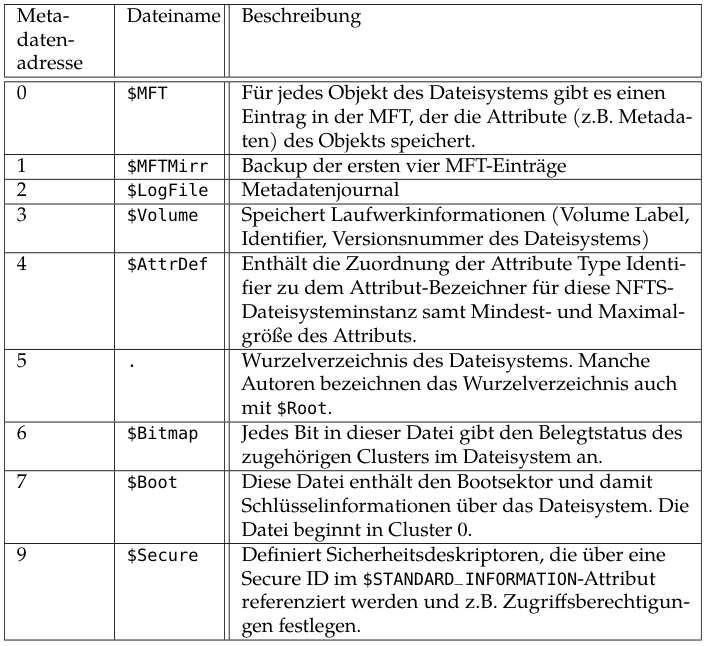


## Dateisystemlayout

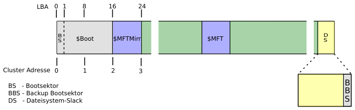

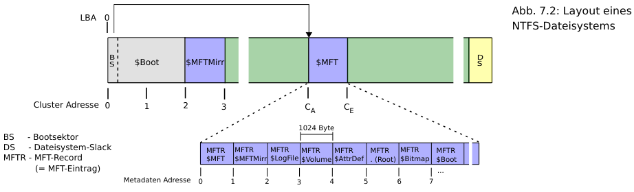

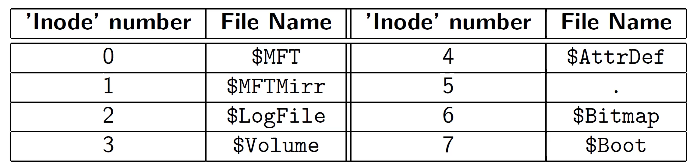

* `$Boot`: Bootsektor ist gleichzeitig laut dem Paradigma auch eine Datei.
  * Metadatenadresse 7
  * Backup in Dateisystem-Slack.
* `$MFT`: Master File Table
  * Metadatenadresse 0
  * beinhaltet Metadaten aller Objekte
  * Größe der Einträge: 1KiB = 1024 Byte
  * Eintrag mit Metadatenadresse refereziert
  * Metadatenadresse 0-15: Dateisystemdateien
  * MFT-Zone: für MFT reservierten Bereich
* `$MFTMirr`: Backup der `$MFT`
  * Metadatenadresse 1
  * beinhaltet 4 Einträge (MFT, MFTMirror, Metadatenjournal, Laufwerkinformationen)
  * Größe: 1 Cluster = 4 KiB = 4 * 1 KiB MFT-Eintrag
* `$LogFile`: Metadatenjournal - protokolliert Veränderungen
  * Metadatenadresse 2

## Bootsektor ($Boot)

`$Boot` über Metadatenadresse 7 erreichbar und gleichzeitig der erste Sektor.

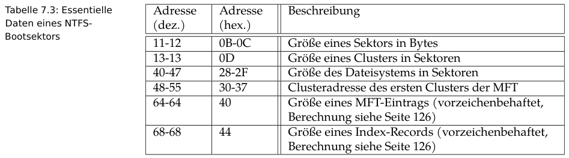

Teilwerte aus defekten NTFS Bootsektor auslesen
```bash
$ file bootsector.dd
# defekter Startcluster der MFT (-1)
bootsector.dd: DOS/MBR boot sector, code offset 0x52+2, OEM-ID "NTFS    ", sectors/cluster 8, Media descriptor 0xf8, sectors/track 0, dos < 4.0 BootSector (0x80), FAT (1Y bit by descriptor); NTFS, sectors 993279, $MFT start cluster -1, $MFTMirror start cluster 62079, bytes/RecordSegment 2^(-1*246), clusters/index block 1, serial number 01f01cfb34fec35f2
```

Bootsektor über seine Metadatenadresse 7 dumpen
```bash
$ icat image-ntfs.dd 7 | xxd
```

Bootsektor über Sektor 0 dumpen
```bash
$ blkcat ntfs.dd 0
```

NTFS-Dateisystem mounten
```bash
$ sudo mount -t ntfs-3g -o ro,loop,noexec,show_sys_files image-ntfs.dd /mnt
```

## MFT-Eintrag

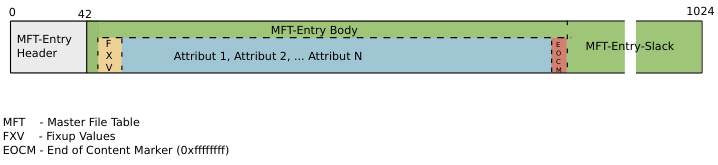

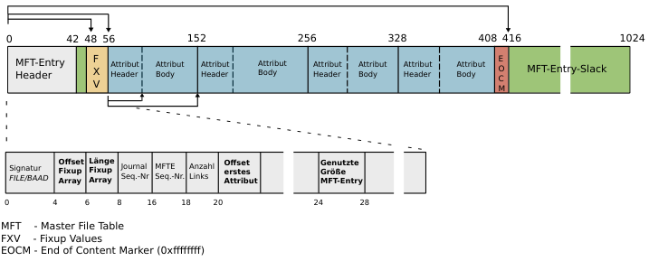

### MFT-Eintrag Header

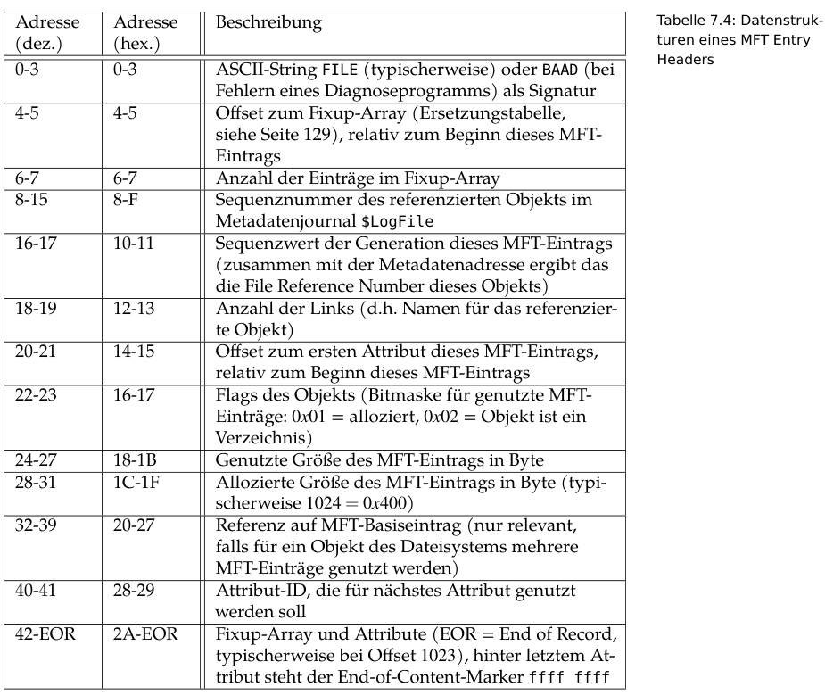

Beispiel eines MFT-Eintrags

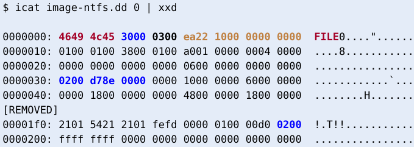

* Objekte werden mit 64-Bit *Dateiadresse* identifizert/adressiert (braun)
  * Metadatenadresse: niederwertigesten 48-Bit
  * Sequenznummber: restlichen 16-Bit

Nach MTF-Einträgen suchen. Jeder Eintrag beginnt mit `FILE0`
```
$ sigfind 46494c45 image-ntfs.dd
Block size: 512  Offset: 0  Signature: 46494C45
Block: 32 (-)
Block: 34 (+2)
Block: 36 (+2)
```

Nach fehlerhaften MFT-Einträgen (`BAAD`) suchen
```bash
$ sigfind 42414144 image-ntfs.dd
```

Auf bestimmtes Attribut einer Metadatenadresse zugreifen
```bash
# auf $STANDARD_INFORMATION (16) Attribut des $MFT (0) Objekts zugreifen
$ icat partition.dd 0-16
```

### Attribute

Attribute sind Teil des MFT-Bodies und kapseln Informationen zu einem Objekt.  
Man unterscheidet
* `residente`: speichern Nutzdaten im Attribut-Body, also im MFT-Eintrag. Für kleine Daten < 1 KiB
* `nicht-residente`: speichern nur Verweis auf Cluster, in dem Nutzdaten liegen
  * Nutzdaten liegen in Cluster-Runs = Folge von Clustern

##### Wichtige Standardattribute in NTFS

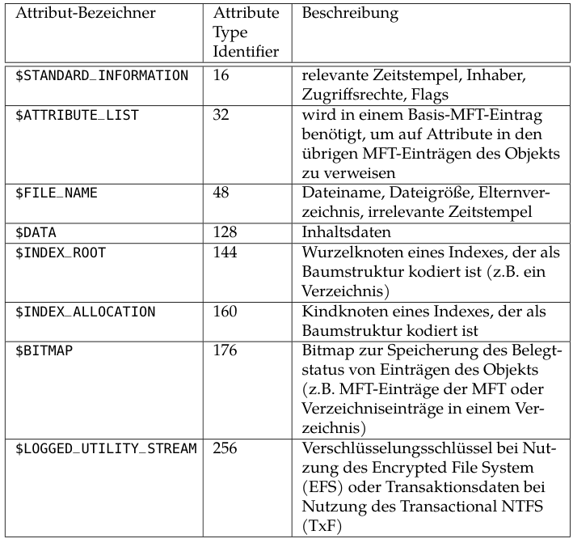

##### Attribut Header: residentes Attribut

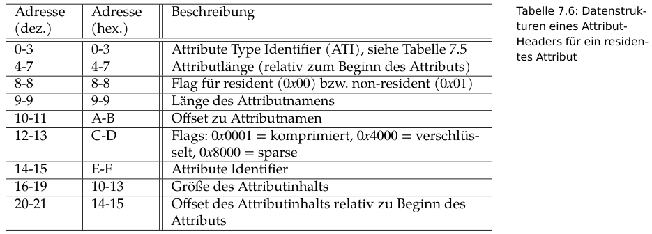

## $Bitmap

Damit lässt sich der Allokationsstatus eines Clusters ermitteln.  
Jedes Bit repräsentiert einen Cluster. 1 Byte ergibt Aufschluss über 8 Cluster.  
Die `$Bitmap` hat die Metadatenadresse `6`.

Allokationsstatus von Cluster 28000 ermitteln
```bash
Byte-Position = 28000 / 8 Cluster pro Byte = 3500 = 0xdac
$ icat image-ntfs.dd 6 | xxd
[...]
00000da0: 00ff ffff ffff ffff ffff ffff 7f00 0000  ................

0x7f = 1111111

LSB = 1 = Cluster ist alloziert
```

## Alternate Data Stream (ADS)

Dateien legen Inhaltsdaten im `$DATA` Attribut ab. Dieses besitzt *keinen* Attributnamen (`Name: N/A`) und ist das Default-Attribut der Inhaltsdaten. Ihre Dateigröße entspricht der, die der Dateibrowser anzeigt. ADS sind zusätzliche `$DATA` Attribute in denen Zusatzinformationen gespeichert werden können.

ADS Dateien finden und anzeigen. `128` ist der Type Identifier von `$DATA`. Mit `-2`, `-3` etc. werden die ADS angegeben.
```bash
$ fls -r image-ntfs.dd
++ r/r 37-128-1:        secret.png
++ r/r 37-128-3:        secret.png:hidden.txt
++ r/r 37-128-4:        secret.png:Zone.Identifier
```

Gleiches lässt sich mit `istat` anzeigen
```bash
$ istat image-ntfs.dd 37
[...]
Attributes:
Type: $DATA (128-1)   Name: N/A   Non-Resident   size: 11913  init_size: 11913
25344 25345 25346
Type: $DATA (128-3)   Name: hidden.txt   Resident   size: 120
Type: $DATA (128-4)   Name: Zone.Identifier   Resident   size: 26
```

ADS anzeigen
```bash
$ icat image-ntfs.dd 37-128-3
[Inhalt anzeigen]
```

## Zeitstempel

Die relevanten Zeitstempel befinden sich im `$STANDARD_INFORMATION` Attribut.  
Zeitstempel = Anzahl der Zeiteinheiten (100ns) bezüglich Referenzpunkt.

# FSInfo
Bitmap-Datentruktur. Gibt den Allokationsstatus eines Clusters an. Adresse steht als nicht-essentieller Eintrag im Bootsektor an Offset 48-49.  
Liegt aber gewöhnlich im Sektor 2, umittelbar nach dem Bootsektor.


FSInfo Bereich ausgeben
```bash
$ blkcat image.dd 1 1 | xxd -a
```

## Dateiforensik

* `v` = `virtual`: virtuelle Metadatenadresse - gibt es nicht. Stellt `fls` zum einfachen Umgang mit Dateisystem bereit
* `r` = `regular file`
* `d` = `directory`
* `$MBR` = Bootsektor, NICHT MBR

Informationen von `fls`
```bash
$ fls -r fat32_partition.dd
[REMOVED]
v/v 4784131:    $MBR
v/v 4784132:    $FAT1
v/v 4784133:    $FAT2
[REMOVED]
```

Metadatenadresse einer Datei zu einem Sektor finden
```bash
$ ifind -d 10950 wc.dd
21
```

Vollständigen Dateinamen anhand Metadatenadresse erhalten
```bash
$ ffind wc.dd 26
* /find_me
```

### File Carving

File Carving immer dann sinnvoll, wenn es kein Dateisystem gibt, also vor allem bei nicht-allozierten Bereichen. Nicht-Allozierte Bereiche kennzeichnet `mmls` mit `Unallocated`. In ihnen können neben **versteckten Dateien** auch auch **Partitionstabellen** liegen.

Versuchen Dateien mit File Carving zu extrahieren
```bash
$ binwalk --dd='.*' meeting.jpeg
```

# Windows Forensik

## Standardverzeichnisse

| Verzeichnis               |   Abkürzung    |      Pfad    |
| ------------------------- | -------------- | ------------ |
| Windows-Systemverzeichnis | `%SystemRoot%` | `C:\Windows` |
| Nutzerspezifisches Standardverzeichnis | `%UserProfile%` | `C:\Users\USER` |

## Umgebungsvariablen

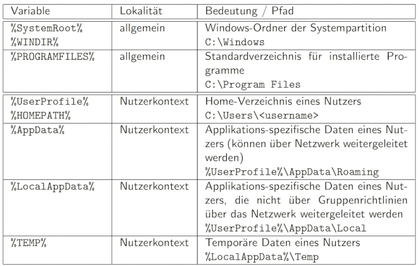

**[...]\Roaming vs. [...]\Local**

Dateien in **Local** werden nicht synchronisiert, wenn sich der Benutzer im gleichen Netzwerk an einem anderen Rechner anmeldet.

### Systemweite-Standardverzeichnisse

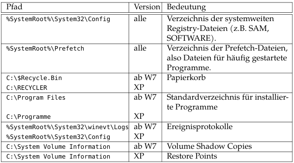

Mithilfe **Prefetch** Dateien lässt sich eine Aussage darüber treffen, ob eine Applikation installiert war. Ebenso lässt sich eine Aussage über die Häufigkeit und den Zeitpunkt der (letzten) Ausführung treffen.

### Nutzerspezifische-Standardverzeichnisse

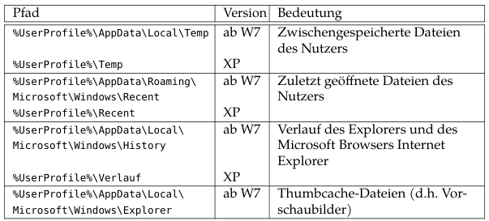

## Security Identifier

Windows nutzt eine eindeutige SID (*Security Identifier*) zur Identifizierung von Nutzern, Gruppen oder Ressourcen. Sie werden auch *Security Principal* genannt.

Nutzer **SID**s beginnen immer mit `S-1-5-21` und folgt der allgemeinen Form `S-1-5-21-<Machine SID>-<User RID>`. Die darauffolgenden 3 Sub-Authorities sind jeweils 32-Bit lang (= 96-Bit) und beschreiben lokale Maschine bzw. Domain. Der 96-Bit Wert wird `Domain SID` oder **Machine SID** genannt. Er wird im Registry Wert `HKLM\SAM\Domains\Account\V` gespeichert. 

**Maschinen SID berechnen**

Wert in `HKLM\SAM\Domains\Account\V` = `18b9 6162 d5cd df86 23ba eb95`

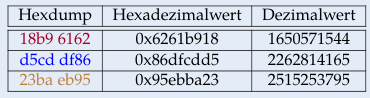

Daraus ergibt sich die Maschinen SID zu `S-1-5-21-1650571544-2262814165-2515253795`

**Maschinen SID aus Hexdump bestimmen**

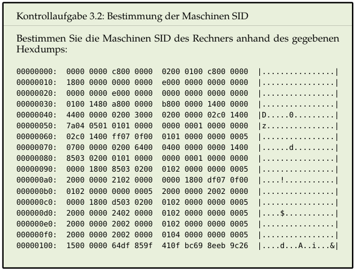

**Aufbau**

```
S-1-IdentifierAuthority-SubAuthority1-...-SubAuthorityn-RelativeIdentifier
```
* "S": kennzeichnet String als SID
* "1": Version der SID-Spezifikation
* `IdentifierAuthority`: gibt Sicherheitsinstanz (`Security Authority`) an. "5" beschreibt Security Authoriy `SECURITY_NT_AUTHORITY`. Ihre Aufgabe ist z.B. Vergabe der SID für Nutzer.
* `SubAuthority`: Hängt von Identifier Authority ab. Bei SECURITY_NT_AUTHORITY lautet er "21" und ist für IDs der Security Principals zuständig.
* `RelativeIdentifier` (**RID**): beschreibt bestimmten Security Principal im Kontext der vorhergehenden Authorities. Bei der RID im Kontext einer Nutzer SID gelten folgende Konventionen. Die Zuordnung von RID zu Nutzername erfolgt über SAM Datei.
  * 500 (0x1f4): Standard-Administrator
  * 501 (0x1f5): Standard-Gast
  * ab 1000 (0x3e8) = individuell eingerichtete Nutzeraccounts

Die SID eines Nutzers hat die Form `S-1-5-21-<Machine ID>-<user RID>`. SID des Standard-Administrators z.B. `S-1-5-21-1650571544-2262814165-2515253795-500`, des ersten angelegten Nutzers z.B. `S-1-5-21-1650571544-2262814165-2515253795-1000`.

**SID eines Windows Nutzers**

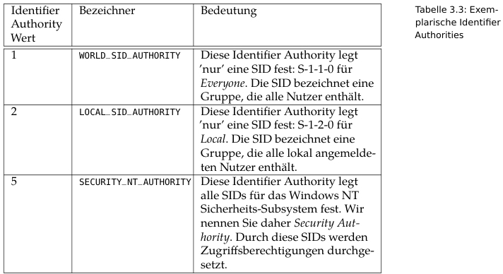

**Wichtige SIDs**

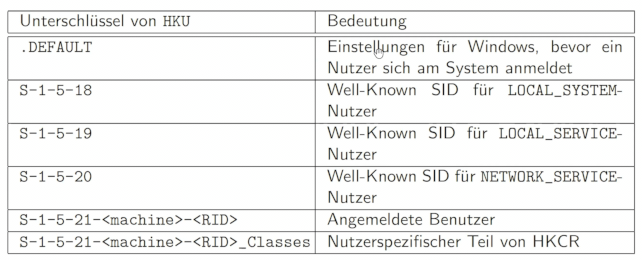

`LOCAL_SYSTEM` ist äquivalent zum Nutzer `root` unter Linux.

**Liste aller Windows Nutzer ermitteln**

Registry-Schlüssel `HKLM\Software\Microsoft\WindowsNT\CurrentVersion\ProfileList` enthält alle lokalen oder domänen Nutzer, die sich mindestens einmal angemeldet haben. Alternativ Tool `PsGetSid` verwenden.

## Windows Registry

Herausforderungen bei der forensischen Untersuchung der Windows Registry:
* Unvollständige Dokumentation
* Hohe Komplexität und Umfang: Registry wird auch von Drittherstellern genutzt
* Fehlende Stabilität: Einträge unterscheiden sich in unterschiedlichen Windows Versionen
* Volatilität: nicht alle Einträge sind persistent. Registry wird beim Systemstart in Arbeitsspeicher geladen. Volatile Registryeinträge z.B. `HKLM_HARDWARE` sind bei Post-Mortem Analyse nicht verfügbar.

## Live vs. Persistent
Live
* in den RAM geladene Instanz der Registry
* vom `Configration Manager` (CM) verwaltet
* Erkennbar an `CURRENT` Schlüssel

Persistent
* Gespeichert in Hive Dateien (in `%SystemRoot%\system32\config`)
* nutzerspezifische Hive Dateien im Profilordner des jeweiligen Nutzers
* Enthält **keine** `CURRENT` Schlüssel

### Struktur der Registry

Die Windows Registry ist eine hierarchisch organisierte Datenbank bzw. Baumstruktur. Sie wird vom `Configuration Manager` (CM) verwaltet. Die Knoten des Baums sind Schlüssel. Die Informationen zu einem Schlüssel werden in 3-Tupel gespeichert.

* Schlüssel (*key*): Knoten in Baumstruktur. Ist eine Art Container.
* Wert (*value*): Speichert Informationen eines Schlüssels in Werten. Ein Wert ist ein 3-Tupel aus (Name des Wertes, Datentyp, Daten).
* Unterschlüssel (*subkey*): Kindknoten eines Registryschlüssels.

Hauptschlüssel bilden oberste Ebene der Registry. Nur HKU und HKLM sind Hauptschlüssel. Die drei übrigen Hauptschlüssel sind Verweise auf Unterschlüssel von HKU un HKLM.

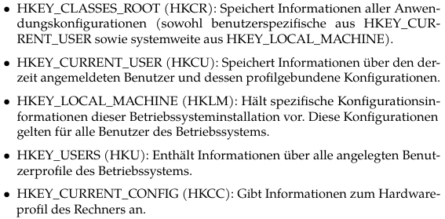

* `HKEY_CURRENT_CONFIG` (HKCC) ist ein Verweis auf `HKEY_LOCAL_MACHINE\SYSTEM\CurrentControlSet\Hardware Profiles\Current\`
* `HKEY_CLASSES_ROOT` (HKCR): kombiniert die beiden HIVES (forensisch nachrangig)
  * `HKEY_CURRENT_USER\Software\Classes`: systemweite Einstellungen und Standardwerte für z.B. Dateieindungen
  * `HKEY_LOCAL_MACHINE\Software\Classes`: benutzerspezifische Einstellungen
* `HKEY_CURRENT_USER` (HKCU): verweist auf einen Unterschlüssel in `HKEY_USERS`, der der SID des aktuellen Nutzers entspricht.

## Registry Hives

Die Registry setzt sich aus mehreren diskreten Dateien, sogennanten **Hive-Daten** zusammen. Ein *Hive* legt einen Zweig in der Baumstruktur fest.

| Hive | Mount Point | Speicherort | Inhalt |
| ---- | ----------- | ------ | -------- |
| HKU\DEFAULT | `HKEY_USERS\DEFAULT` | `%SYSTEMROOT%\system32\config\` | - |
| HKLMSAM | `HKEY_USERS\DEFAULT` | `%SYSTEMROOT%\system32\config\` |*Security Account Manager* (SAM) verwaltet Sicherheitskonten aller angelegten Nutzer. Enthält gehashtes Nutzerpasswort. |
| HKLM\SECURITY | `HKEY_LOCAL_MACHINE\Security`  | `%SYSTEMROOT%\system32\config\` | enthält SAM und ist für Zugriffsberechtigungen zuständig |
| HKLM\SOFTWARE | `HKEY_LOCAL_MACHINE\Software` | `%SYSTEMROOT%\system32\config\` | speichert Einstellungen zu installierten Anwendungen |
| HKLM\SYSTEM | `HKEY_LOCAL_MACHINE\System`  | `%SYSTEMROOT%\system32\config\` | speichert Konfiguration zu Geräten und Diensten |
| NTUSER.DAT (HKCU) | `HKEY_CURRENT_USER` | `%UserProfile%\` | - |
| HKCU\Software\Classes (USRCLASS.DAT) | `HKEY_CURRENT_USER\Software\CLASSES` | `%UserProfile%\AppData\Local\Microsoft\Windows\` | - |

Ab Windows 10 `AmCache.hve` im Verzeichnis `%SystemRoot%\AppCompat\Programs`.

Das `SAM` Hive kann in der Registry zwar geladen, dessen nutzerspezifische Unterschlüssel aber nicht angezeigt werden. Der Administrator-Account ist nicht privilegiert genug. Der `SYSTEM` Nutzer ist dazu notwendig.

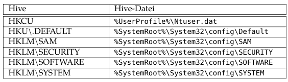

Es gibt gleichnamige Backup und Logdateien zu den Hive-Dateien, sogenannte *Unterstützungsdateien*, mit unterschiedlichen Dateiendungen, um unbrauchbare Hive-Dateien widerherzustellen.

* `.log`: ogfile über Änderungen der zugehörigen Hive-Datei
* `.sav`: Backup-Kopie der zugehörigen Hive-Datei während des Setups
* `.alt`: Zusätzliche Backup-Kopie der Hive-Datei SYSTEM

**Hive Backup erstellen**

Man benötigt sowohl das Hive selbst als auch die Logdateien (`C:\Windows\System32\config\TxR\*.LOG`). In den Transaktionslogs stehen womöglich aktueller Informationen. Beide Dateien müssen z.B. mit `Registry Explorer` (Zimmermann) oder `registry-transaction-logs` zusammengeführt werden. Alte Backups mit bereits gelöschten Schlüsseln können unter `C:\Windows\System32\config\RegBack` liegen.

```bash
$ pip install regipy
$ registry-transaction-logs NTUSER.DAT -p ntuser.dat.log1 -s ntuser.dat.log2 -o recovered_NTUSER.dat
```

Quelle: https://andreafortuna.org/2021/02/06/windows-registry-transaction-logs-in-forensic-analysis/

**Aufbau**

Ein *Block* ist die Speichereinheit einer Hive-Datei und ist 4 KiB groß. Die Anzahl allozierter Blöcke wächst bzw. schrumpft je nach Bedarf. Die Informationen eines Schlüssels oder Wertes werden in Containern, sog. *Zellen* gespeichert. Ein *Bin* speichert eine oder mehrere Zellen. Offsets in einer Hive-Datei werden relativ zum Beginn des ersten *bins* angegeben.

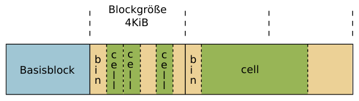

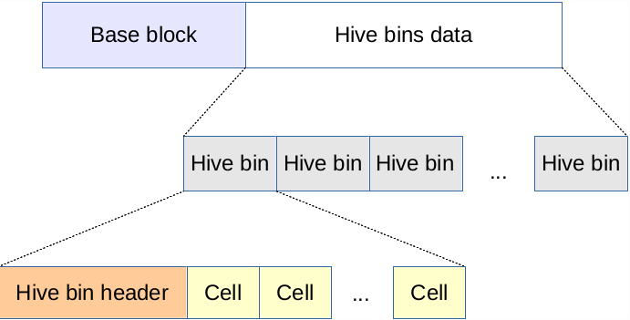

Der erste Block heißt Basisblock.

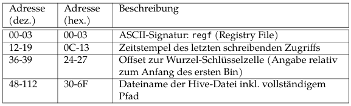

Basisblock-Header der SAM

**Wann ist ein HIVE dirty?**
`Primary Sequence Number` und `Secondary Sequence Number` müssen identisch sein, ansonsten ist das Hive *dirty*. Sie geben die Anzahl der (abgeschlossenen) Schreibvorgänge an.

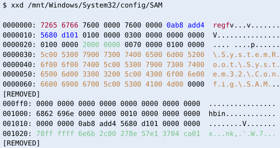

An Offset `0x24` steht das relative Offset zur Wurzelschlüsselzelle. Es lautet in diesem Beispiel  `0x20`. Die Wurzelschlüsselzelle beginnt hier ab Offset `0x1020` (zu den angegebenen Offset muss also immer `0x1000` addiert werden).


### Bin

Speichert eine oder mehrere *Zellen*. Hat einen 32 Byte Header und einem Payload, der aus einer oder mehreren Zellen besteht.

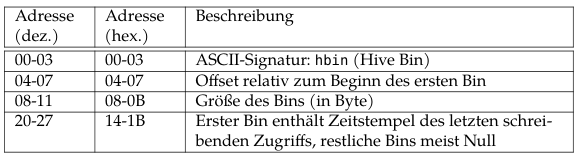

### Zellen

Zellen speichern die Daten innerhalb eines Hives. Sie dienen als Container, um Informationen über Schlüssel oder Werte abzulegen.

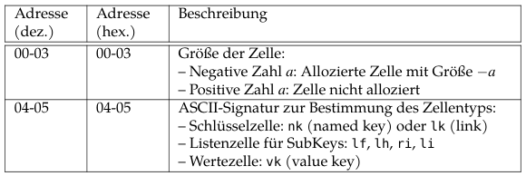


#### Aufgabe Zelle

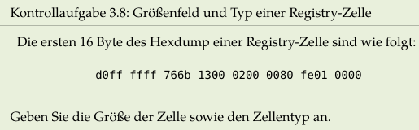

`0xffffffd0` = `-48` im Zweierkomplement (https://legacy.cryptool.org/de/cto/numberconverter). Die Größe der Zelle ist `-a` = `--48` = 48 Byte. Der Typ ist `766b` bzw. `v (0x76) k (0x6b)`. Es handelt sich somit um eine Wertezelle (*value key*).

### Registry Slack

Tool: ? (Vorlesung 2 Folien)

### Analysestrategie für Registry

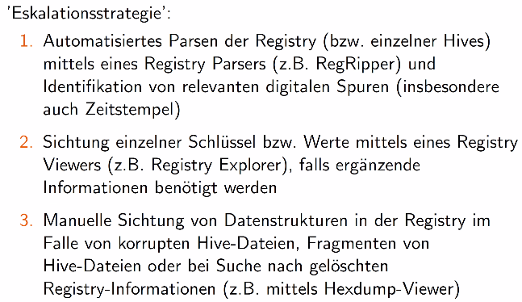

